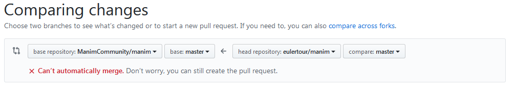

# Contributing

Thank you for contributing to Manim!  However you have decided to contribute or
interact with the community, please always be civil and respect other members
of the community.  Manim is a free open source software for mathematical
animations, and as such we welcome **everyone** who is interested in
mathematics, pedagogy, computer animations, open source, software development,
and beyond.  Manim accepts contributions of many kinds, detailed below.


## Reporting bugs

One of the best ways of contributing to Manim is by reporting bugs.  If you
have encountered something that you believe is a bug, please follow these
steps:

1. First of all, make sure you are running the latest version of manim.  If
   not, update your version and try again.

2. Make sure to search for other users who may have had similar issues in the
   past.  Search the repository's issues page (don't forget to search closed
   issues), bring it up on Discord, use sites like StackOverflow, and exercise
   your best Google practices.  If you can't find anything helpful, then go to
   the next step.

3. Make sure you can reproduce the issue, i.e. that you have some code that
   illustrates the bug **every time** (or at least most of the time) it is
   executed.
   
4. Make sure to clarify what behavior you expected, and how the actual behavior
   differs from your expectation.

5. Make sure to gather information about your environment, such as your
   operating system, python version, and any stack traces that the code may
   have generated (if applicable).
   
4. Please open an issue only after you have gathered this information.  When
   submitting an issue, make sure to follow the template (this is the default
   text you are shown when first opening the 'New Issue' page).  A community
   member will (hopefully) respond and start a conversation to address the
   issue.
   
7. Please give the community a reasonable amount of time before asking again,
   or insisting on your issue.  Keep in mind that everyone is a volunteer.  If
   you wait for a reasonable amount of time and you receive no response, feel
   free to ask again.


## Contributing code

Many ways of contributing will involve writing, reading, testing, or
refactoring code.  As our repository is a Fork of [Manim by
3b1b](https://github.com/3b1b/manim), contributing in this way can be a bit
confusing.  Here is a short guide on how to do it.

1. First, make a fork of this repository.  This creates your own copy of the
   whole codebase on GitHub.

2. Clone the repository you forked using the command below (bash/zsh).

   ```sh
     git clone <your-fork-url>
     cd manim
   ```

	Note: do not `git clone` the original ManimCommunity repository.  You must
    clone your own fork.  After this step, there are three different
    repositories to keep track of: the original ManimCommunity repo, your own
    fork of it, and your local repository.

3. You have to make `git` be aware of the two remote repositories, by entering
   the commands below.

   ```sh
   git remote add upstream https://github.com/ManimCommunity/manim.git
   git fetch upstream
   ```

	After these commands, your local repository can keep track of your fork
    (referred to as 'origin') as well as the main ManimCommunity repository
    (referred to as 'upstream').

4. Choose the correct branch for your changes.  If you are working on a branch
   that already exists on the main repository, you can execute
   ```sh
   git checkout -b <branch-name> upstream/master
   ```
   
   If you are starting a new branch, execute
   ```sh
   git checkout -b <new_branch-name>
   ```

	You can now make any changes to your local repository, add them, and commit
   them.

5. To make your changes visible in your GitHub fork, instead of typing in `git
   push` as usual, you need to enter the command below.

   ```sh
   git push -u origin <branch-name>
   ```

   Doing so creates a new branch with the updated contents of your fork on
   GitHub (the 'origin').

6. If you want your changes to be incorporated to the main ManimCommunity
   repository, you need to make sure that there are no merge conflicts between
   the current upstream/master and the changes you are trying to make.  For
   this purpose, please execute `git pull upstream master` before you push
   changes to your fork.  If this generates merge conflicts, make sure to
   resolve them before submitting a PR.

7. Further, make sure that you run the tests locally and that they all pass
   before submitting a PR.  You can run the tests locally by executing `pytest`
   from the main `manim/` folder (do not execute pytest from the code folder
   `manim/manim`).

8. Finally, make sure to use the `black` autoformatter before submitting a PR.
   You can execute it by running `black <your_file>`.  This will make changes
   to your code, and you will need to add/commit those changes.

9. To request the ManimCommunity dev team to incorporate the changes in your
   fork into the main repository, you can make a Pull Request to the Manim
   Community repo from your fork. Make sure to select `ManimCommunity/manim`
   instead of `3b1b/manim` as the `base repository` and your fork and branch as
   `head repository` - see the picture below.

   

	Once again, please make sure to follow the template (this is the default
    text you are shown when first opening the 'New Pull Request' page)

10. Once a PR is submitted, it will require at least two approving code
    reviews from community developers, as well as all tests passing.  It is
    very likely that you will be asked to edit or modify your PR in one way or
    another during this process.  This is not an indictment of your work, but
    rather a strong signal that the dev community wants to merge your changes!

Note: before submitting a PR please make sure that you update the docstrings of
any methods, classes, or modules that your PR modifies, if necessary.

Note: if you are contributing new features or bug fixes, it is strongly
preferred that you include tests that accompany them in your PR.  For this
purpose, you can create a new file under the `tests/` folder and make sure that
your new tests pass before submitting your PR. Please check out the [Wiki Entry
for Testing](https://github.com/ManimCommunity/manim/wiki/Testing) to learn
more about how our tests work.

Note: if you are contributing documentation, you must also make sure that the
command `make doctest`, executed from the `docs/` folder terminates without
problems. Please check out the [Wiki Entry for
Documentation](https://github.com/ManimCommunity/manim/wiki//Documentation-guidelines-(WIP))
to learn more about how we prefer our code documented.

Note: In order to open a PR, you do not need to have everything
(documentation/tests) complete and ready to go.  However, the more complete
your PR is, the easier it will be for community devs to review it, and the
quicker it will be merged.  If you open a PR that is still under development
and you want a quick overview or start some discussion about planned
yet-to-be-implemented changes, please mark your PR as a draft.


## Other guidelines

1. When submitting a PR, please make special note of whether your proposed
   changes will result in breaking changes.

2. When submitting a PR, make sure that your proposed changes are as general as
   possible, and ready to be taken advantage of by all of manim's users.  In
   particular, leave out any machine-specific configurations, or any personal
   information it may contain.

3. If you are a maintainer, please label issues and PRs appropriately and
   frequently.

4. When opening a new issue, if there are old issues that are related, link
   them in your new issue (even if the old ones are closed).

5. When submitting a code review, it is highly recommended that you adhere to
   [these general guidelines](https://conventionalcomments.org/).  Similarly,
   when crafting commit messages, it is highly recommended that you adhere to
   [these guidelines](https://www.conventionalcommits.org/en/v1.0.0/).
   
6. If you find stale or inactive issues that seem to be irrelevant, please post
   a comment saying 'This issue should be closed', and a community developer
   will take a look.

7. Please do as much as possible to keep issues, PRs, and development in
   general as tidy as possible.
   

   
