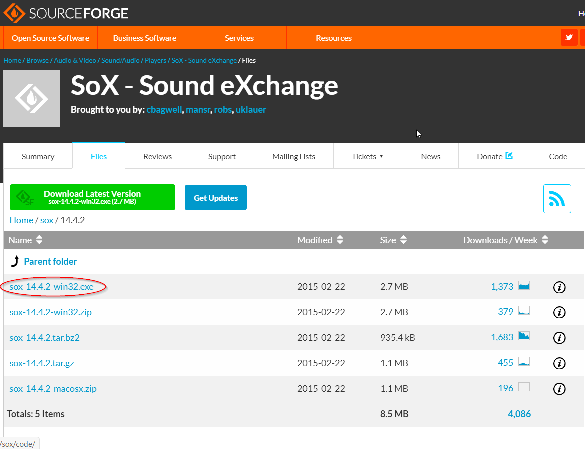

[](https://travis-ci.com/ManimCommunity/manim)
[](https://www.eulertour.com/docs)
[](http://choosealicense.com/licenses/mit/)
[](https://www.reddit.com/r/manim/)
[](https://discord.gg/mMRrZQW)

Manim is an animation engine for explanatory math videos. It's used to create precise animations programmatically, as seen in the videos at [3Blue1Brown](https://www.3blue1brown.com/).

> NOTE: This repository is maintained by the Manim Community, and is not associated with Grant Sanderson or 3Blue1Brown in any way (though we are definitely indebted to him for providing his work to the world). If you want to study how Grant makes his videos, head over to the main repository (3b1b/manim). This is a more frequently updated repository than the main one, and is recommended if you want to use Manim for your own projects.


## Table of Contents:
- [Installation](#installation)
  * [Windows](#windows)
    + [Cairo Installation](#cairo-installation)
    + [FFmpeg Installation](#ffmpeg-installation)
    + [SoX Installation](#sox-installation)
    + [LaTeX Installation](#latex-installation)
  * [Ubuntu/Debian](#Ubuntu/Debian)
    + [Cairo Installation](#cairo-installation-1)
    + [FFmpeg Installation](#ffmpeg-installation-1)
    + [SoX Installation](#sox-installation-1)
    + [LaTeX Installation](#latex-installation-1)
    + [Additional Installation Steps](#additional-installation-steps)
  * [Mac](#mac)
    + [Homebrew Installation](#homebrew-installation)
    + [Cairo Installation](#cairo-installation-2)
    + [FFmpeg Installation](#ffmpeg-installation-2)
    + [SoX Installation](#sox-installation-2)
    + [LaTeX Installation](#latex-installation-2)
  * [Installing Manim-Community itself](#installing-manim-community-itself)
- [Usage](#usage)
- [Documentation](#documentation)
- [Help with Manim](#help-with-manim)
- [Contributing](#contributing)
- [License](#license)

## Installation

### Windows

Before installing `manim-community`, there are some additional dependencies that you must have installed:
 - Cairo
 - FFmpeg
 - Sox (optional, for sound)
 - LaTeX (optional, for LaTeX)

#### Cairo Installation
1. Visit the [Download Page](https://www.lfd.uci.edu/~gohlke/pythonlibs/#pycairo)
2. Select the download that corresponds to your PC's architechture and Python Version


<br><br>

> cp38 corresponds to Python 3.8, cp37 corresponds to Python 3.7, etc
> win_amd64 corresponds to 64-bit machines, win32 corresponds to 32-bit machines

3. Open up your command prompt by hitting the Win key and typing `cmd`

4. Enter the directory where you install cairo by typing `cd C:\path\to\cairo` with the path being where you downloaded the `.whl` file

5. Finally, run `pip3 install (cairo-file).whl`, where the file the appropriate name of the `.whl` file.

6. Alternatively, Running the command below installs pycairo. This needs to be an elevated command prompt like Powershell.

   ```powershell
   (Invoke-WebRequest -Uri https://raw.githubusercontent.com/ManimCommunity/manim/master/scripts/pycairoinstall.py -UseBasicParsing).Content | py -3
   ```

   

#### FFmpeg Installation
1. To install `ffmpeg` and add it to your PATH, install [Chocolatey](https://chocolatey.org/) and run `choco install ffmpeg`
2. You can check you did it right by running `refreshenv` to update your environment variable and running `ffmpeg`

#### SoX Installation
1. Go to the SoX [SourceForge](https://sourceforge.net/projects/sox/files/sox/) page
2. Select the newest version, and download the `.exe` file


<br><br>

3. Add SoX to your PATH
    - Find the directory where SoX is installed. By default, this is probably `C:\Program Files (x86)\sox-(version_number)` or `C:\Program Files\sox-(version_number)`
    - Open a command prompt window by hitting the Win key and typing `cmd`
    - Run this command to update your PATH: `setx PATH %PATH%;C:\Program Files (x86)\sox-(version_number)`
    - Check you did it right by running `refreshenv` to update your environment variable and running `sox`

#### LaTeX Installation
1. Download the MiKTex installer from its [Download Page](https://miktex.org/download)
2. You can check you did it right by running `refreshenv` to update your environment variable and running `latex`


<br><br>

### Ubuntu/Debian

Before installing `manim-community`, there are some additional dependencies that you must have installed:
 - Cairo
 - FFmpeg
 - Sox (optional, for sound)
 - LaTeX (optional, for LaTeX)

#### Cairo Installation
1. Install the `libcairo2-dev` package with your package manager: `sudo apt-get install libcairo2-dev`

#### FFmpeg Installation
1. Install the `ffmpeg` package with your package manager: `sudo apt-get install ffmpeg`
2. You can check you did it right by running `ffmpeg -version`

#### SoX Installation
1. Install the `sox` package with your package manager: `sudo apt-get install sox`
2. You can check you did it right by running `sox`

#### LaTeX Installation
1. Install `texlive` with your package manager by running the following commands:
```
sudo apt install texlive texlive-latex-extra texlive-fonts-extra texlive-latex-recommended texlive-science texlive-fonts-extra tipa
```
> Note: this installation may take up a lot of space. The developers are working on providing a simpler, lighter LaTeX package for you to install
2. You can check you did it right by running `latex`

#### Additional Installation Steps
- You must install additional codecs to play MP4 files:
```
sudo apt install libdvdnav4 libdvd-pkg gstreamer1.0-plugins-bad gstreamer1.0-plugins-ugly libdvd-pkg
sudo apt install ubuntu-restricted-extras
```

### Mac

Before installing `manim-community`, there are some additional dependencies that you must have installed:
 - Homebrew
 - Cairo
 - FFmpeg
 - Sox (optional, for sound)
 - LaTeX (optional, for LaTeX)

#### Homebrew Installation

Homebrew is a package manager similar to `apt` on linux that allows you to install packages easily.
If it is not installed, please install it with this command:

```
ruby -e "$(curl -fsSL https://raw.githubusercontent.com/Homebrew/install/master/install)" < /dev/null 2> /dev/null
```

#### Cairo Installation
1. Run `brew install cairo`

#### FFmpeg Installation
1. Refer to the section on Brew installation to see how to install `brew`
2. Run `brew install ffmpeg`
3. You can check you did it right by running `ffmpeg -version`

#### SoX Installation
1. Refer to the section on Brew installation to see how to install `brew`
2. Run `brew install sox`
3. You can check you did it right by running `sox`

#### LaTeX Installation
1. Refer to the section on Brew installation to see how to install `brew`
2. Run `brew cask install mactex`
3. You can check you did it right by running `latex`

> Note that MacTeX will require at least 4.5GB of hard disk space and bandwidth.
>
> This is due to the fact that it installs every LaTeX addon package offered by [CTAN](https://ctan.org/). Only a few of these packages are required by Manim.
>
> If you would like a smaller LaTeX install which only contains the packages needed by Manim alone, consider installing BasicTeX and suitable packages with the instructions below. This will require about 1.5 GB of space and bandwidth.

If you have installed MacTeX and are comfortable with it, do not install BasicTeX.

1. Refer to the section on Brew installation to see how to install `brew`
2. Run `brew cask install basictex`
3. Ensure that the TeXLiveManager tool `tlmgr` works, by running `tlmgr --version` in the terminal.
4. Run `sudo tlmgr install standalone preview doublestroke relsize fundus-calligra wasysym physics dvisvgm.x86_64-darwin dvisvgm rsfs wasy cm-super`
4. Ensure that LaTeX works by running `latex` in the Terminal.


### Installing Manim-Community itself

Manim runs on Python 3.7+. If you'd like to just use the library, you can install it from PyPI via pip:

```sh
pip3 install manimlib
```

However, if you'd like to contribute to and/or help develop
`manim-community`, you can clone this branch to your local device. To do
this, first make sure you have `git` installed. Then, clone this repo by
executing either

```sh
git clone git@github.com:ManimCommunity/manim.git
```

or

```sh
git clone https://github.com/ManimCommunity/manim.git
```

depending on whether you want to use HTTPS or SSH. Finally, run the
following:

```sh
python3 -m pip install -r requirements.txt
```

## Usage

To run your first example Scene, you can run the following commands:

### For users:

1. Download the `example_scenes/basic.py` file from [GitHub](https://github.com/ManimCommunity/manim/blob/master/example_scenes/basic.py)
2. Run the following command:
```sh
manim example_scenes/basic.py SquareToCircle -pl
```

### For developers:

- Run the following command to install manim:
```sh
pip install -e .
```
- Then run the following command below:
```sh
manim example_scenes/basic.py SquareToCircle -pl
```


The `-p` flag in the command above is for previewing, meaning the video file will automatically open when it is done rendering. The `-l` flag is for a faster rendering at a lower quality.

Some other useful flags include:
* `-s` to skip to the end and just show the final frame.
* `-n <number>` to skip ahead to the `n`'th animation of a scene.
* `-f` to show the file in finder (for OSX).

You can also set `MEDIA_DIR` environment variable to specify where the image and animation files will be written.

## Documentation
Documentation is in progress at [eulertour.com/docs](https://www.eulertour.com/docs/).

## Help with Manim
The issues board is reserved for bugs, and future features planned for Manim. If you need help installing or using Manim, please take a look at [the Reddit Community](https://www.reddit.com/r/manim) or the [Discord Community](https://discord.gg/mMRrZQW)

## Contributing
Is always welcome. In particular, there is a dire need for tests and documentation. 

For instructions, guidelines and other details, please check out the file [CONTRIBUTING.md](https://github.com/ManimCommunity/manim/blob/master/CONTRIBUTING.md).

## License

The software is double-licensed under the MIT license, with copyright
by 3blue1brown LLC (see LICENSE), and copyright by Manim Community
Developers (see LICENSE.community).

