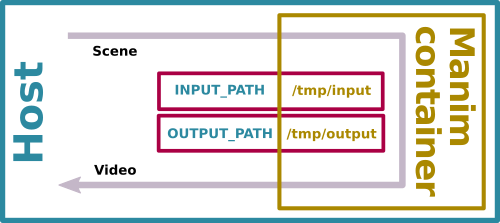

[](https://travis-ci.org/3b1b/manim)
[](https://www.eulertour.com/docs)
[](http://choosealicense.com/licenses/mit/)
[](https://www.reddit.com/r/manim/)
[](https://discord.gg/mMRrZQW)

Manim is an animation engine for explanatory math videos. It's used to create precise animations programmatically, as seen in the videos at [3Blue1Brown](https://www.3blue1brown.com/).

This repository contains the version of manim used by 3Blue1Brown. There is also a community maintained version at https://github.com/ManimCommunity/manim/.
To get help or to join the development effort, please join the [discord](https://discord.gg/mMRrZQW).

## Installation
Manim runs on Python 3.6 or higher version. You can install it from PyPI via pip:

```sh
pip3 install manimlib
```

System requirements are [cairo](https://www.cairographics.org), [ffmpeg](https://www.ffmpeg.org), [sox](http://sox.sourceforge.net) (optional, if you want to play the prompt tone after running), [latex](https://www.latex-project.org) (optional, if you want to use LaTeX).

You can now use it via the `manim` command. For example:

```sh
manim my_project.py MyScene
```

For more options, take a look at the [Using manim](#using-manim) sections further below.

### Directly

If you want to hack on manimlib itself, clone this repository and in that directory execute:

```sh
# Install python requirements
python3 -m pip install -r requirements.txt

# Try it out
python3 ./manim.py example_scenes.py SquareToCircle -pl
```

### Directly (Windows)
1. [Install FFmpeg](https://www.wikihow.com/Install-FFmpeg-on-Windows).
2. [Install Cairo](https://www.lfd.uci.edu/~gohlke/pythonlibs/#pycairo). For most users, ``pycairo‑1.18.0‑cp37‑cp37m‑win32.whl`` will do fine (you can download it or other versions from [here](https://www.lfd.uci.edu/~gohlke/pythonlibs/#pycairo)).
    ```sh
    pip3 install C:\path\to\wheel\pycairo‑1.18.0‑cp37‑cp37m‑win32.whl
    ```
3. Install a LaTeX distribution. [MiKTeX](https://miktex.org/download) is recommended.

4. [Install SoX](https://sourceforge.net/projects/sox/files/sox/).

5. Install the remaining Python packages.
    ```sh
    git clone https://github.com/3b1b/manim.git
    cd manim
    pip3 install -r requirements.txt
    python3 manim.py example_scenes.py SquareToCircle -pl
    ```


## Anaconda Install

* Install sox and latex as above. 
* Create a conda environment using `conda env create -f environment.yml`
* **WINDOWS ONLY** Install `pyreadline` via `pip install pyreadline`. 


### Using `virtualenv` and `virtualenvwrapper`
After installing `virtualenv` and `virtualenvwrapper`
```sh
git clone https://github.com/3b1b/manim.git
mkvirtualenv -a manim -r requirements.txt manim
python3 -m manim example_scenes.py SquareToCircle -pl
```

### Using Docker
Since it's a bit tricky to get all the dependencies set up just right, there is a Dockerfile and Compose file provided in this repo as well as [a premade image on Docker Hub](https://hub.docker.com/r/eulertour/manim/tags/). The Dockerfile contains instructions on how to build a manim image, while the Compose file contains instructions on how to run the image.

The prebuilt container image has manim repository included.
`INPUT_PATH` is where the container looks for scene files. You must set the `INPUT_PATH`
environment variable to the absolute path containing your scene file and the
`OUTPUT_PATH` environment variable to the directory where you want media to be written.

1. [Install Docker](https://docs.docker.com)
2. [Install Docker Compose](https://docs.docker.com/compose/install/)
3. Render an animation:
```sh
INPUT_PATH=/path/to/dir/containing/source/code \
OUTPUT_PATH=/path/to/output/ \
docker-compose run manim example_scenes.py SquareToCircle -l
```
The command needs to be run as root if your username is not in the docker group.

You can replace `example.scenes.py` with any relative path from your `INPUT_PATH`.



After running the output will say files ready at `/tmp/output/`, which refers to path inside the container. Your `OUTPUT_PATH` is bind mounted to this `/tmp/output` so any changes made by the container to `/tmp/output` will be mirrored on your `OUTPUT_PATH`. `/media/` will be created in `OUTPUT_PATH`.

`-p` won't work as manim would look for video player in the container system, which it does not have.

The first time you execute the above command, Docker will pull the image from Docker Hub and cache it. Any subsequent runs until the image is evicted will use the cached image.
Note that the image doesn't have any development tools installed and can't preview animations. Its purpose is building and testing only.

## Using manim
Try running the following:
```sh
python3 -m manim example_scenes.py SquareToCircle -pl
```
The `-p` flag in the command above is for previewing, meaning the video file will automatically open when it is done rendering. The `-l` flag is for a faster rendering at a lower quality.

Some other useful flags include:
* `-s` to skip to the end and just show the final frame.
* `-n <number>` to skip ahead to the `n`'th animation of a scene.
* `-f` to show the file in finder (for OSX).

Set `MEDIA_DIR` environment variable to specify where the image and animation files will be written.

Look through the `old_projects` folder to see the code for previous 3b1b videos. Note, however, that developments are often made to the library without considering backwards compatibility with those old projects. To run an old project with a guarantee that it will work, you will have to go back to the commit which completed that project.

While developing a scene, the `-sp` flags are helpful to just see what things look like at the end without having to generate the full animation. It can also be helpful to use the `-n` flag to skip over some number of animations.

### Documentation
Documentation is in progress at [eulertour.com/docs](https://www.eulertour.com/docs/). And there is also an all-in-one documentation and tutorials maintained by **@manim-kindergarten**: [manim.ml](https://manim.ml/) (in Chinese).

### Walkthrough
Todd Zimmerman put together a [tutorial](https://talkingphysics.wordpress.com/2019/01/08/getting-started-animating-with-manim-and-python-3-7/) on getting started with manim, which has been updated to run on Python 3.7.

[manim-kindergarten](https://github.com/manim-kindergarten/) wrote and collected some useful extra classes and some codes of videos in [manim_sandbox repo](https://github.com/manim-kindergarten/manim_sandbox).

## Contributing
Only accepts pull requests that fixes bugs / fixes typos / improves existing content (for more information, see [#1243](https://github.com/3b1b/manim/issues/1243)). Most pull requests should be directed to the [community version](https://github.com/ManimCommunity/manim/).

## License
All files in the directory `from_3b1b`, which by and large generate the visuals for 3b1b videos, are copyright 3Blue1Brown.

The general purpose animation code found in the remainder of the repository, on the other hand, is under the MIT license.
