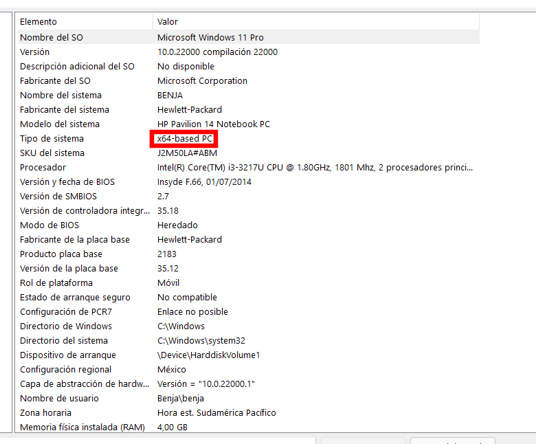

## Documentación

[Logo de Manim](https://github.com/3b1b/manim/blob/master/logo/cropped.png)

### ¿Qué es Manim Spanish?
Manim Spanish es una bifurcación de ManimGL que tiene como objetivo expandir Manim a la gente hispanohablante con una documentación totalmente ordenada, tutoriales bien detallados desde cero (no necesitarás saber nada de programación) y nuevas características 👌. Para usar Manim necesitas un computador, sin importar que éste no sea muy moderno, que tenga instalado Windows, Mac OSX o Linux y para instalar necesitarás conexión a internet. La guía completa de instalación se encuentra [aquí](https://hachedoso.github.io/ManimSpanish/#instalación).

#### ¿Por qué usar Manim?
- *Porque* genera animaciones que asombran, atraen e impactan.
- *Porque* es tremendamente didáctico y podrás hacer excelentes explicaciones.
- *Porque* es completamente gratuito, legal y de código abierto.
- *Porque* se puede usar desde diversos sistemas operativos.
- *Porque* se puede usar en computadores antiguos.
- *Porque* es el momento de que todos innovemos en la educación: el cambio parte desde las acciones.
- *Porque* la educación digital es la nueva forma de educación.

### Instalación
La instalación dependerá de tu sistema operativo, por lo que habrá instalación para Windows, para Mac OSX y para Linux.

#### Windows
Primero que todo, necesitamos checar si nuestro computador es de 64 bits o de 32 bits. Para ello presiona las teclas `Windows` y `R` al mismo tiempo. Se abrirá una ventana. Escribe `msinfo32` y presiona `Enter`. Se abrirá otra ventana, y la derecha de ésta se verá algo así.

Presta atención al rectángulo rojo. Si dice `x64-based PC`, tu computador es de 64 bits, mientras que si dice `x86-based PC`, tu computador es de 32 bits.
Una vez obtenida esa información, debemos instalar Python. Para descargar el instalador de Python para computadores de 64 bits, [haz clic aquí](https://www.python.org/ftp/python/3.9.6/python-3.9.6-amd64.exe). De otro modo, si tu computador es de 32 bits, para descargar el instalador de Python [haz clic aquí](https://www.python.org/ftp/python/3.9.6/python-3.9.6.exe).
Ahora abres el instalador y marcas la opción `Add Python 3.9 to PATH`. Luego dale a `Install Now`. Cualquier mensaje que salga, hay que aceptar. Cuando haya terminado de instalar, te aparecerá el mensaje "Setup was successful". Para finalizar la instalación de Python, haz clic al botón `Close`.
