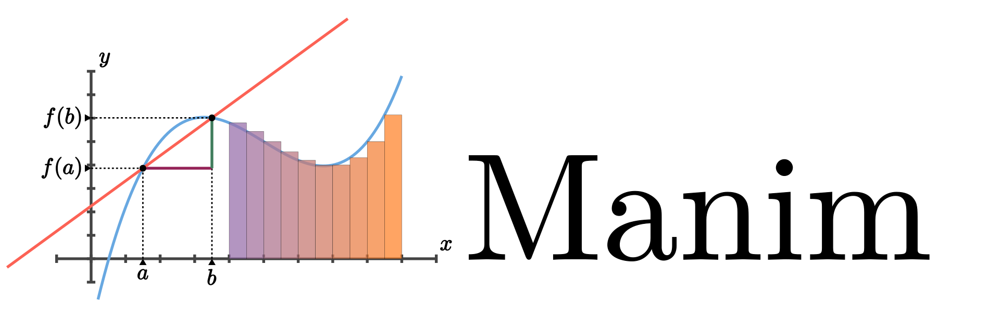

Manim's documentation
=====================

Manim is an animation engine for explanatory math videos. It's used to create precise animations programmatically, as seen in the videos
at `3Blue1Brown <https://www.3blue1brown.com/>`_.

.. toctree::
   :maxdepth: 2

   install/index
   quickstart/index

Indices and tables
==================

* :ref:`genindex`
* :ref:`modindex`
* :ref:`search`
