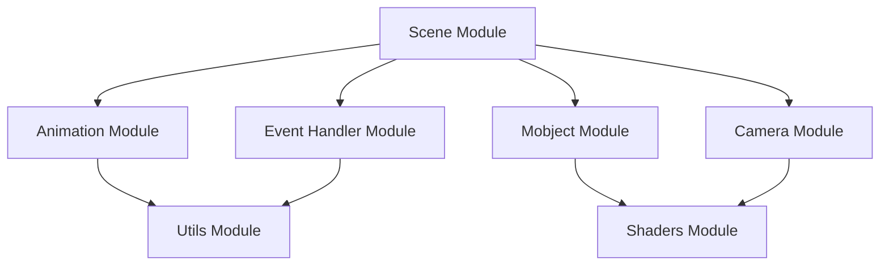

# Manim Library Documentation

## Overview
Manim is a powerful mathematical animation library that enables the creation of precise, programmatic animations for mathematical concepts. This documentation provides a comprehensive guide to the library's architecture and capabilities.

## Core Architecture

### Module Structure
The library is organized into several core modules, each handling specific aspects of the animation system:

1. **Animation Module** (`animation/`)
   - Handles animation creation and management
   - Controls timing and transitions
   - Manages animation sequences

2. **Camera Module** (`camera/`)
   - Manages viewport and rendering
   - Handles 3D perspective
   - Controls scene framing

3. **Event Handler Module** (`event_handler/`)
   - Manages user interactions
   - Handles input events
   - Controls interactive elements

4. **Mobject Module** (`mobject/`)
   - Core visual elements
   - Mathematical objects
   - Text and LaTeX rendering

5. **Scene Module** (`scene/`)
   - Scene management
   - Animation playback
   - Output generation

6. **Shaders Module** (`shaders/`)
   - OpenGL shader system
   - Custom visual effects
   - Advanced rendering

7. **Utils Module** (`utils/`)
   - Utility functions
   - Mathematical operations
   - System integration

## Module Interactions

### Core Workflow
1. **Scene Creation**
   - Scene module initializes the environment
   - Camera module sets up the viewport
   - Event handler module prepares for interaction

2. **Mobject Management**
   - Mobjects are created and modified
   - Shaders are applied for rendering
   - Utils provide supporting functions

3. **Animation Execution**
   - Animations are created and scheduled
   - Camera captures the scene
   - Event handler manages interactions

4. **Output Generation**
   - Scene module coordinates rendering
   - Camera module finalizes frames
   - Utils handle file operations

## Key Features

### 1. Mathematical Visualization
- Precise geometric transformations
- Complex mathematical concepts
- Interactive demonstrations

### 2. Animation System
- Smooth transitions
- Complex sequences
- Custom timing

### 3. Rendering Capabilities
- High-quality output
- Custom shader effects
- 3D support

### 4. Interactive Features
- User input handling
- Real-time updates
- Custom interactions

## Module Dependencies



## Best Practices

### 1. Scene Organization
- Clear structure
- Logical flow
- Proper timing

### 2. Animation Design
- Smooth transitions
- Appropriate pacing
- Clear sequences

### 3. Performance Optimization
- Efficient rendering
- Resource management
- Cache utilization

### 4. Code Organization
- Modular design
- Clear interfaces
- Proper documentation

## Example Workflow

```python
from manim import *

class ExampleScene(Scene):
    def construct(self):
        # Create mobjects
        circle = Circle()
        square = Square()
        
        # Set up animation
        self.play(ShowCreation(circle))
        self.wait()
        
        # Transform
        self.play(Transform(circle, square))
        self.wait()
        
        # Clean up
        self.play(FadeOut(square))
```

## Module Documentation

For detailed information about each module, refer to their respective documentation:

1. [Animation Module](modules/animation.md)
2. [Camera Module](modules/camera.md)
3. [Event Handler Module](modules/event_handler.md)
4. [Mobject Module](modules/mobject.md)
5. [Scene Module](modules/scene.md)
6. [Shaders Module](modules/shaders.md)
7. [Utils Module](modules/utils.md)

## Development Guidelines

### 1. Code Style
- Follow PEP 8
- Use type hints
- Document thoroughly

### 2. Testing
- Unit tests
- Integration tests
- Performance benchmarks

### 3. Documentation
- Clear examples
- API references
- Usage guides

### 4. Version Control
- Semantic versioning
- Changelog maintenance
- Branch management

## Getting Started

1. **Installation**
   ```bash
   pip install manim
   ```

2. **Basic Usage**
   ```python
   from manim import *
   
   class MyScene(Scene):
       def construct(self):
           # Your animation code here
           pass
   ```

3. **Running**
   ```bash
   manim -pql scene.py MyScene
   ```

## Resources

- [Official Documentation](https://docs.manim.community)
- [GitHub Repository](https://github.com/ManimCommunity/manim)
- [Community Forum](https://community.manim.community)
- [Example Gallery](https://docs.manim.community/en/stable/examples.html) 